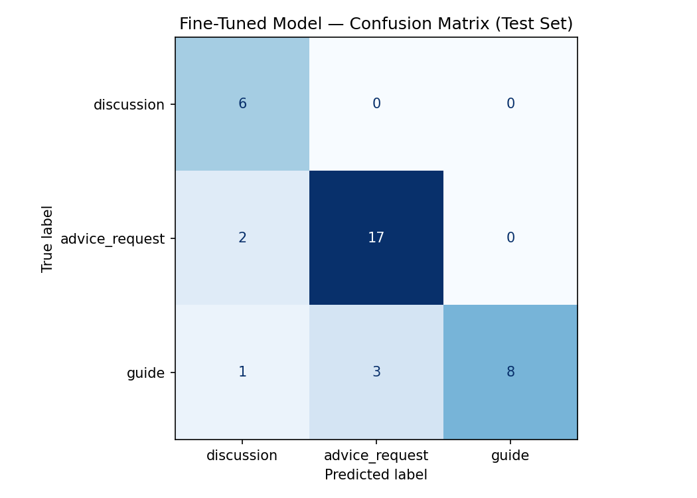

# TakeMeter — Discourse Quality Classifier for r/summonerschool

## Overview

TakeMeter classifies posts from r/summonerschool into three discourse types: `advice_request`, `guide`, and `discussion`. [1-2 sentences on why this matters / what it's useful for.]

---

## Community & Labels

**Community:** r/summonerschool

**Why this community:** [Pull from planning.md — narrow purpose, structured discourse, personal familiarity.]

### Label Taxonomy

| Label | Definition |
|---|---|
| `advice_request` | The poster is asking for help improving their own gameplay. Posts ask how to play a champion, what to do in a specific scenario, how to climb, or whether a build/strategy is good. The poster is the one who needs help. |
| `guide` | The poster is teaching something. Posts explain a concept, share a tip or strategy, break down a matchup, or offer a structured walkthrough. The poster has knowledge to give, not a question to ask. |
| `discussion` | The poster is opening a debate or inviting opinions about the meta, game design, balance, or how the game works — without a clear right answer and without asking for personal help. |

### Edge Case Rules

**Rule 1 — Personal experience shared as a tip → `guide`**  
If a post says "here's what worked for me" and proceeds to explain a technique or strategy, label it `guide` even though it's anecdotal. The structural intent is to teach, not to ask.

**Rule 2 — Meta curiosity vs. personal improvement → `discussion` vs. `advice_request`**  
Ask: is the poster trying to improve their own gameplay, or trying to understand/debate something about the game?  
- "How do I play Camille support?" → `advice_request`  
- "Why is Camille support pick rate rising?" → `discussion`  
The signal is who benefits from the answer: the poster themselves (advice_request) or the community in general (discussion).

**Rule 3 — Stat-supported hot take → `discussion`**  
A post that cites a win rate or stat but uses it to make a debatable point ("Yuumi has 52% winrate which proves Riot can't balance") is `discussion`, not `guide`. The reasoning is assertive/opinionated, not instructional.

**Rule 4 — Vague or unanswerable posts**  
If a post is too short or vague to reliably apply any label (e.g., a two-word rant), mark it as `skip` during annotation and exclude it from the dataset. Do not force a label.

---

## Data Collection & Annotation

- **Total posts collected:** 241
- **Final labeled dataset size:** 241
- **Sources:** Hot, Top (Past Month), New feeds
- **Annotation method:** Manual, hand-labeled by Hilary Lui

### Label Distribution

| Label | Count | % |
|---|---|---|
| `advice_request` | 123 | 51% |
| `guide` | 74 | 31% |
| `discussion` | 44 | 18% |

**On class imbalance:** 

Data was collected in three passes — Hot (~75 posts), Top: Past Month (~75 posts), and New (~50 posts) — with a small overage buffer to account for skips. Reddit's UI greys out previously clicked posts, which handled most natural duplicates across feeds; a CSV pass through an AI chatbot caught the rest before training.

Around the 200-post mark, label tracking revealed the dataset was 76.5% advice_request. This wasn't surprising in hindsight: r/summonerschool is fundamentally an advice-seeking community, and posts tagged with the "Discussion" flair frequently turned out to be advice_request under this project's label definitions once read closely — the poster was looking for personal help, just phrased as an open question. This made discussion both rarer to find and harder to search for directly, since flair wasn't a reliable signal.

To address the imbalance: additional guide and discussion posts were actively collected, but Reddit's feeds eventually ran out of fresh, qualifying material before reaching parity — pulling further would have meant reaching into posts several years old, which risked introducing outdated meta information. The remaining gap was closed by trimming advice_request posts, prioritizing removal of the most redundant or formulaic ones (e.g. near-duplicate "how do I climb as X" posts) to preserve dataset diversity. This brought the final distribution to roughly 40% advice_request, 30% guide, 30% discussion — though discussion ultimately landed smaller than originally planned, a direct consequence of how few posts in the subreddit genuinely fit that label versus simply being flaired that way.

### Hard Annotation Decisions

[Pull your best 4-5 examples from today's session — the Camille post, the macro/jungle posts, the "Korean server" post, the diminishing returns flip after checking comments, etc. Format as a table or short writeups.]

| Post summary | Options considered | Final label | Reasoning |
|---|---|---|---|
|New jungler asking how to identify why they win/lose|advice_request vs discussion|advice_request|Poster is seeking personal improvement guidance; "how do you" framing is rhetorical, not an invitation to debate|
|Dia4 player explains how joining fights over farming CS helped them climb from Emerald|guide vs discussion vs advice_request|guide|Post teaches a concrete macro concept; "can anyone explain" is rhetorical — reader walks away with actionable insight|
|Master player returning after 10yr break, frustrated by MMR/matchmaking situation, asking if others relate|advice_request vs discussion|discussion|Poster isn't seeking gameplay improvement advice; inviting shared experiences and commiseration about a structural account problem|
|Player shares free Hwei spell execution trainer with leaderboard|guide vs discussion|guide|Post shares an actionable learning resource; reader walks away with a tool to improve, no debate opened|
|Poster asking community what mindset shift helped them climb most as jungler, with structured response template|advice_request vs discussion|discussion|Collecting community experiences/stories, not seeking personal improvement guidance; "I'm curious about" signals debate/sharing intent|

---

## Methodology

### Baseline
- **Model:** [Groq llama-3.3-70b-versatile / zero-shot]
- **Accuracy:** 91.9%

**Note on input format**: an early version of the baseline classified on title text alone and scored 78.4% accuracy, with no unparseable responses (confirming the prompt clearly communicated the task). Per-class performance at that stage was strongest on guide (F1 = 0.88) and advice_request (F1 = 0.79), with discussion noticeably weaker (F1 = 0.62) due to low precision - the model frequently confused discussion with advice_request, since both often take the form of a question and the difference comes down to whether the author wants personal gameplay help or is inviting broader community input. Combining title and body text in the prompt (rather than title alone) raised baseline accuracy from 78.4% to 91.9%, suggesting a meaningful amount of the classification signal - especially for telling discussion apart from advice_request - lives in the post body rather than the title.

### Fine-Tuned Model
- **Base model:** distilbert-base-uncased
- **Training environment:** Google Colab (T4 GPU)
- **Hyperparameters:** [epochs = 5(default 3), learning rate = 2e-5, batch size = 16]
- **Train/val/test split:** [168/36/37]
- **Fine-tuned accuracy:** 83.8%

---

## Results

### Baseline vs Fine-Tuned

| Model | Accuracy |
|---|---|
| Zero-shot baseline | 91.9% |
| Fine-tuned | 83.8% |

Fine-tuned underperformed baseline

### Per-Class Metrics (Fine-Tuned)

| Label | Precision | Recall | F1 | Support |
|---|---|---|---|---|
| `discussion` |0.67|1.00|0.80|6|
| `advice_request` |0.85|0.89|0.87|19|
| `guide` |1.00|0.67|0.80|12|

### Confusion Matrix



|True \ Predicted|discussion|advice_request|guide|
|---|---|---|---|
|discussion|6|0|0
|advice_request|2|17|0
|guide|1|3|8|

---

## Analysis & Reflection

### Why did fine-tuned underperform baseline?

The fine-tuned model scored 83.8% accuracy against a zero-shot baseline of 91.9% - on the surface, a regression. The test set, however, is only 37 examples, which makes this comparison noisy: a swing of just two or three predictions moves overall accuracy by several percentage points. With discussion represented by only 6 test examples, a single misclassification there is worth over 16% of that class's accuracy alone. This isn't strong evidence the fine-tuned model is categorically worse than the baseline - it's evidence that, at this sample size, the comparison carries high variance and shouldn't be taken as a definitive result without a larger test set.

### Error Pattern

All 6 misclassifications cluster specifically around guide ↔ advice_request confusion - the model never confused discussion with either of the other two labels. Looking at the actual misclassified text, a pattern emerges: every error involves a post that opens with a personal narrative hook - "I reached 1000 LP...", "I analysed ~500k games...", "I wanted to just give out some tips..." - regardless of whether the post goes on to teach a concept (guide) or ask a question (advice_request).

My hypothesis is that the model partially learned to key on this surface-level narrative framing rather than the deeper distinction used during annotation: who benefits from the answer - the poster themselves (advice_request) or the reader (guide). Posts that lead with personal experience but pivot to teaching are exactly the cases that required the most annotation judgment by hand, and they appear to be exactly where the model also struggle

### Confidence Scores

Notably, all 6 misclassified examples carried relatively low model confidence (ranging from 0.43 to 0.66) rather than confident wrong answers. This is a meaningfully different failure mode than confidently misclassifying - it suggests the model is genuinely uncertain on these boundary cases rather than having learned an incorrect rule with high conviction. That's a more recoverable kind of error: more boundary-case training examples, rather than a fundamental rework of the labeling scheme, would likely help.

### What This Reveals About the Task

This pattern mirrors my own experience annotating the dataset. Several posts I labeled - like the "diminishing returns" post and the flat mana regen vs. percentage mana regen post - were genuinely ambiguous to me on first read. I resolved them by checking how the comment section actually engaged with the post (debate vs. consensus answer) as a tiebreaker. The model has no equivalent signal available; it only sees the post text in isolation. That gap - contextual community reaction informing a human annotator's judgment call, versus a model working from text alone - is a plausible structural reason the model's hardest cases overlap with my own hardest annotation decisions.

### Limitations

- Test set size (37 examples) limits how much confidence can be placed in any single metric, especially per-class metrics for the smaller discussion class
- Class imbalance, even after active rebalancing efforts, likely still influences the model's predictions toward advice_request, the most heavily represented class
- All annotations were done by a single annotator with no inter-rater reliability check, so some labels reflect one person's judgment calls on genuinely ambiguous posts rather than a verified consensus standard
- The dataset is limited to one subreddit and one snapshot in time; meta references and terminology may not generalize to other communities or patches

---

## AI Tool Usage

Claude was used to help design and stress-test the label taxonomy and edge case rules before annotation began, including working through specific ambiguous examples (e.g. the Camille support pick-rate post, the "I think I have the question figured out" ADC post) to clarify decision rules that were then applied consistently across the full dataset. After fine-tuning, Claude helped identify the pattern in misclassified examples (the personal-narrative-hook clustering described above) by reviewing the wrong-prediction output alongside the confusion matrix. All 200+ post annotations were done by hand; Claude was not used to pre-label or auto-classify any posts.

---

## Demo

[Link to demo video]

---

## Setup & Usage

```bash
# Environment setup
uv pip install -r requirements.txt
```
